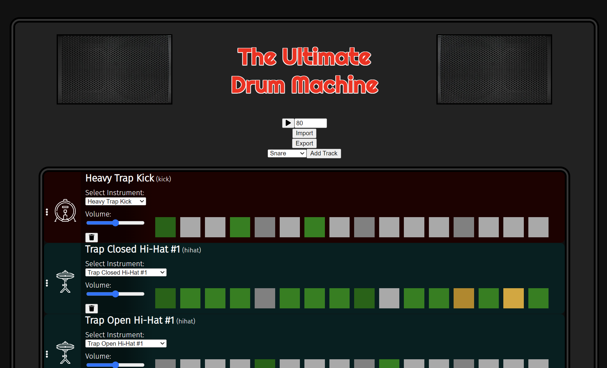

# The Ultimate Drum Machine



A browser-based, 16‑step drum sequencer built with React + TypeScript and powered by Tone.js.

Live demo: https://dolphinswarm.github.io/the-ultimate-drum-machine

## Features

- 16-step grid sequencer
- Add tracks by instrument category (kick, snare, hi-hat, clap, FX, crash, ride, tom, accessory)
- Switch instruments per track (dropdown)
- Per-track volume control
- Drag-and-drop track reordering
- BPM control (30–240)
- Pattern import/export (downloads a file you can re-load later)

## Getting started

### Prerequisites

- Node.js (recommended: LTS)
- npm

### Install

```bash
npm install
```

### Run locally

```bash
npm start
```

Then open http://localhost:3000.

### Build

```bash
npm run build
```

### Test

```bash
npm test
```

## How to use

1. Add a track
	- Pick a category under “Add track”, then click “Add”.
2. Program beats
	- Double-click a step to toggle it.
	- Most instruments: Off → On → Off
	- Hi-hat steps: Off → On → Roll → Off
3. Press Play
	- Browsers require a user gesture before audio will start; clicking Play will resume the audio context.
4. Tweak your groove
	- Change BPM (applies when you leave the BPM input).
	- Use the volume slider per track.
	- Switch instruments with the “Select Instrument” dropdown.
	- Reorder tracks by dragging the handle (three-dots icon).

## Import / Export

- Export: click “Export” to download `beat.txt` (it contains JSON for the full drum machine state).
- Import: click “Import” and select a previously exported file.

Tip: exported files include both the current pattern and the remaining available instruments, so re-importing brings back the same project state.

## Deployment (GitHub Pages)

This repo is set up to deploy the production build to GitHub Pages.

```bash
npm run deploy
```

Notes:

- `npm run deploy` runs `npm run build` first (via `predeploy`).
- The `homepage` field in `package.json` controls the GitHub Pages base path.

## Project structure

- `src/components/` – UI components (tracks, beats, controls)
- `src/state/` – state reducer/actions (Redux Toolkit slice used via `useReducer`)
- `src/hooks/getInitialState.ts` – defines all available sample tracks and initial state
- `public/sample/` – audio samples grouped by category
- `public/img/` – UI images/icons

## Tech

- React + TypeScript (Create React App)
- Tone.js for sample playback and scheduling
- react-beautiful-dnd for track reordering

## Future Improvements
- Effects (reverb, etc.)
- Fix issues with deployment and playback